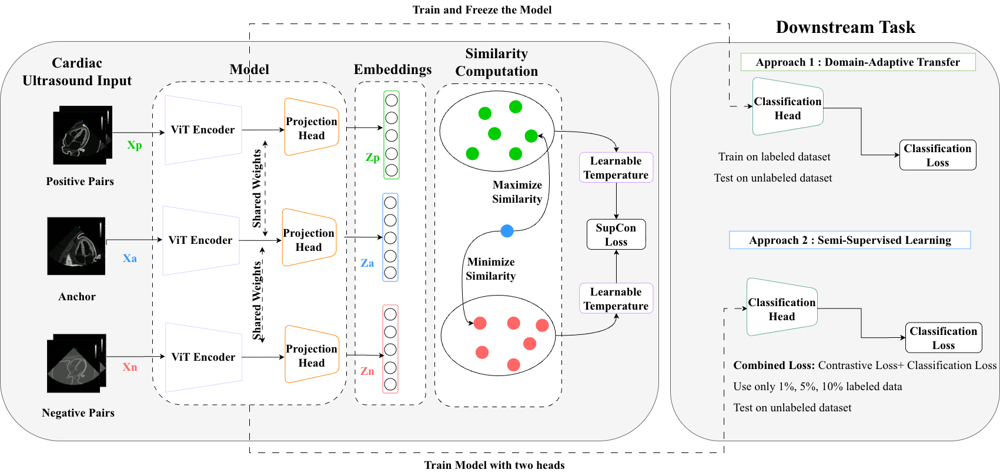

# Semi-Supervised Domain-adaptive Distillation Learning for Annotation-Efficient Echocardiography

  

## Project Description
The development of a domain-adaptive semi-supervised learning framework for echocardiography analysis that integrates labeled and unlabeled data within a unified semantic representation. By jointly optimizing contrastive representation learning and task-specific supervision, the proposed approach aligns unlabeled samples with labeled semantic structures, mitigates domain shift, and reduces reliance on expert annotations, using temperature scaling and evaluating extensively on several datasets and benchmarked against several vision-language models (VLMs), demonstrating promising results.

## Ablation Studies and Downstream Evaluation
cl_losses_temp_comparison.py:

This file contains the code used to obtain the results for the ablation studies. In this file, we compare three different contrastive losses: supervised contrastive loss, N-pair loss, and the proposed symmetric contrastive loss. We also compare two temperature strategies: a fixed temperature and a learnable temperature.
The experiments are conducted on three datasets: the Vimedix phantom dataset, the Cactus dataset, and human echocardiography data.

semi_supervised_classification_cl.py:

This file evaluate the classification performance of the proposed framework using semi-supervised setting.

domain_adapter_transfer_classification.py:

This file demonstrates the evaluation procedure after training the encoder using contrastive learning. The trained encoder is saved and used in a frozen version, on top of which a classifier head is added. The classifier is trained on the labeled dataset (A) and then evaluated on a different dataset (B). Through contrastive representation learning, the model is able to generalize and predict classes for dataset (B).

## VLMs Benchmark

The `VLM` folder contains implementations and experiments for:
- Fine-tuning
- Zero-shot evaluation
- Few-shot evaluation

## Self-Distillation Without Negative Samples (DINO)

The `DINO` folder contains the implementation of self-distillation with temporal contrastive learning.
